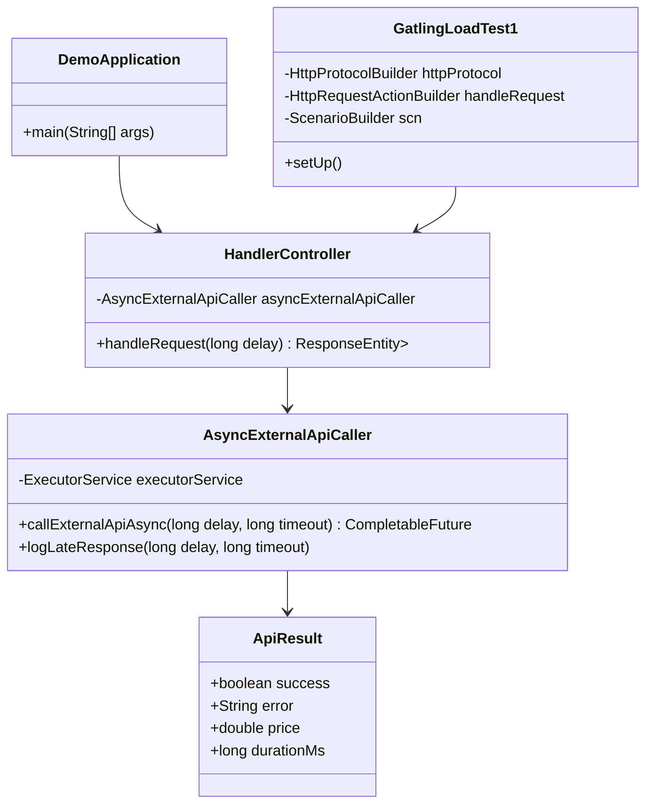

# Diagramme de classes simplifié

## Description des classes

- **DemoApplication** : Point d'entrée de l'application Spring Boot.
- **HandlerController** : Contrôleur REST qui gère les requêtes `/handle` et utilise `AsyncExternalApiCaller` pour appeler l'API externe de façon asynchrone.
- **AsyncExternalApiCaller** : Service qui encapsule l'appel asynchrone à l'API externe via un `CompletableFuture` et un pool de threads.
- **ApiResult** : Classe qui représente le résultat de l'appel à l'API externe (succès, erreur, prix, durée).
- **GatlingLoadTest1** : Classe de test de charge Gatling qui simule des appels à `/handle` et vérifie les réponses.

## Interactions

- `DemoApplication` démarre l'application et initialise `HandlerController`.
- `HandlerController` reçoit les requêtes, appelle `AsyncExternalApiCaller` pour l'appel asynchrone, et retourne une réponse HTTP.
- `AsyncExternalApiCaller` utilise un pool de threads pour exécuter l'appel à l'API externe et retourne un `CompletableFuture<ApiResult>`.
- `GatlingLoadTest1` simule des appels à `/handle` et vérifie les réponses pour les tests de charge. 