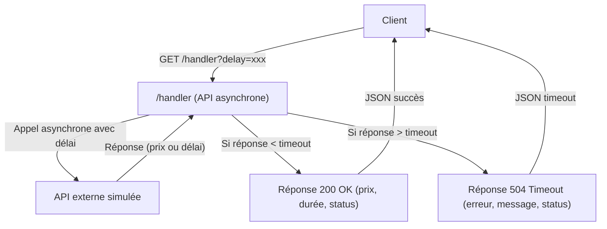

# POC API Asynchrone avec Timeout (Spring Boot, Gatling)

Ce projet expose une API HTTP permettant de simuler un appel asynchrone à une API externe lente. Vous envoyez une requête avec un paramètre de délai, et vous récupérez soit un prix simulé (si la réponse arrive à temps), soit une erreur de timeout (si l'API externe est trop lente).

Voici le flux principal du projet :



---

## 1. Prérequis & Installation

- Java 11 ou supérieur
- Maven 3.6 ou supérieur

### Installation
1. Cloner le projet
2. Se placer dans le répertoire du projet
3. Compiler le projet :
```bash
mvn clean install
```

---

## 2. Démarrage rapide (Quick Start)

1. Démarrer l'application :
   ```bash
   mvn spring-boot:run
   ```
2. Accéder à l'API : http://localhost:8081/handler
3. Lancer un test de charge :
   ```bash
   mvn gatling:test
   ```
4. Consulter les métriques Prometheus : http://localhost:8081/actuator/prometheus
5. Voir les rapports Gatling :
   ```
   target/gatling/[nom-du-test]-[timestamp]/index.html
   ```

---

## 3. Structure du projet

Le projet est organisé pour séparer clairement la logique métier, les contrôleurs, la configuration asynchrone, la simulation d'API externe et les tests (unitaires, d'intégration et de charge). Cette structure facilite la compréhension, l'extension et la maintenance du code.

```
src/
├── main/
│   ├── java/
│   │   └── com/
│   │       └── example/
│   │           └── demo/
│   │               ├── DemoApplication.java                # Point d'entrée Spring Boot
│   │               ├── HandlerController.java              # Contrôleur principal (endpoint /handler)
│   │               ├── api/
│   │               │   ├── AsyncExternalApiCaller.java         # Service d'appel asynchrone à l'API externe
│   │               │   └── AsyncExternalApiCallerConfig.java  # Configuration des pools de threads asynchrones
│   │               └── externalApi/
│   │                   ├── ExternalApiController.java         # Contrôleur simulant l'API externe
│   │                   └── ExternalApiService.java            # Service de calcul simulé pour l'API externe
│   └── resources/
│       └── application.properties                        # Configuration de l'application
└── test/
    └── java/
        └── com/
            └── example/
                └── demo/
                    ├── DemoApplicationTests.java             # Tests unitaires de l'application
                    ├── GatlingLoadTest1.java                 # Simulation de charge Gatling
                    └── externalApi/
                        └── ExternalApiControllerTest.java    # Tests unitaires du contrôleur externe
```

---

## 4. Fonctionnalités principales & Endpoints

### Endpoint principal
- URL : `/handler`
- Méthode : GET
- Paramètres :
  - `delay` : délai en millisecondes (optionnel, défaut : 0)
- Exemple : http://localhost:8081/handler?delay=100

#### Exemple de réponse en cas de succès
```json
{
  "requestId": "0001",
  "price": 1234.56,
  "durationMs": 1500,
  "status": "SUCCESS"
}
```

#### Exemple de réponse en cas de timeout
```json
{
  "requestId": "0002",
  "error": "EXTERNAL_API_TIMEOUT",
  "message": "Request timeout after 2000ms (requested delay: 2300ms)",
  "status": "TIMEOUT"
}
```

---

## 5. Configuration & Personnalisation

Le fichier `application.properties` contient la configuration de base :
- Port : 8081
- Logging : configuré pour afficher les IDs de requête et les durées
- Timeout, taille des pools, URL API externe, etc.

**Pour personnaliser :**
- Modifier les propriétés dans `src/main/resources/application.properties`
- Ajouter de nouvelles propriétés si besoin (voir doc/POOL_CONFIGURATION.md)

---

## 6. Scripts d'automatisation (PowerShell)

Des scripts PowerShell sont fournis pour automatiser certaines tâches :
- `run_gatling_with_app.ps1` : build, lancement de l'app, exécution du test Gatling, extraction des métriques, ouverture des rapports
- `start-signoz.ps1`, `setup-signoz-cloud.ps1` : démarrage/installation de Signoz pour l'observabilité
- `start-jaeger-native.ps1` : démarrage de Jaeger pour le tracing

**Voir les commentaires en tête de chaque script pour l'usage détaillé.**

---

## 7. Logs, gestion des erreurs & sécurité

Les logs incluent :
- ID de requête (format : 4 chiffres)
- Délai de traitement
- Durée totale de la requête
- Nombre de requêtes actives 

### Gestion des timeouts et erreurs HTTP 504
- Si l'API externe met plus de 2000 ms à répondre, le contrôleur retourne une réponse JSON avec le code HTTP 504 (Gateway Timeout).
- Les réponses HTTP 504 sont comptabilisées comme des erreurs (KO) dans les rapports Gatling.

### Sécurité (POC)
- **Attention :** Ce POC n'implémente pas d'authentification ni de validation avancée des entrées. Pour un usage production, il est recommandé d'ajouter :
  - Authentification (JWT, OAuth, etc.)
  - Validation stricte des paramètres
  - Filtrage des erreurs exposées

---

## 8. Tests (unitaires, manuels, automatisés)

### Tests manuels

Vous pouvez tester l'API manuellement avec curl :

```bash
curl http://localhost:8081/handler?delay=100
```

### Tests automatisés

Pour exécuter les tests unitaires :
```bash
mvn test
```

---

## 9. Tests de charge avec Gatling

Le projet inclut des tests de charge avec Gatling. Le scénario de test comprend plusieurs phases (ramp-up, charge constante, etc.).

Pour lancer les tests de charge :
```bash
mvn gatling:test
```

Les rapports sont générés dans :
```
target/gatling/[nom-du-test]-[timestamp]/index.html
```

---

## 10. Observabilité & Prometheus

L'application expose des métriques techniques et métier au format Prometheus via l'endpoint `/actuator/prometheus`.

- Pour une introduction détaillée à Prometheus et son intégration, voir [doc/PROMETHEUS.md](doc/PROMETHEUS.md)
- Pour l'observabilité générale (logs, métriques, traces), voir [doc/OBSERVABILITE.md](doc/OBSERVABILITE.md)

### Exemples de métriques exposées
- `external_api.success.count`, `external_api.timeout.count`, `external_api.late_response.count`, etc.
- Timers : `external_api.all.duration`, `external_api.success.duration`, ...

---

## 11. Scalabilité, limites & extensibilité

- Le POC est dimensionné pour la démo et les tests de charge raisonnables.
- Pour la production, adapter la taille des pools, la gestion des timeouts, la robustesse des endpoints.
- Voir [doc/POOL_CONFIGURATION.md](doc/POOL_CONFIGURATION.md) et [doc/USE_CASES_ASYNC_TIMEOUT.md](doc/USE_CASES_ASYNC_TIMEOUT.md) pour les bonnes pratiques.
- Pour ajouter un nouveau service ou endpoint, suivre l'architecture modulaire (voir [doc/ARCHITECTURE.md](doc/ARCHITECTURE.md)).

---

## 12. Glossaire

- **Asynchrone** : traitement non bloquant, qui se poursuit sans attendre la fin d'une opération longue
- **Timeout** : durée maximale d'attente avant d'abandonner une opération
- **Pool de threads** : ensemble de threads réutilisables pour exécuter des tâches en parallèle
- **Prometheus** : système de monitoring open source pour collecter et visualiser des métriques
- **Gatling** : outil de test de charge pour simuler des utilisateurs et mesurer la performance
- **Micrometer** : bibliothèque Java pour l'instrumentation des métriques
- **CompletableFuture** : API Java pour la programmation asynchrone

---

## 13. Documentation détaillée

Retrouvez dans le dossier `doc/` des explications approfondies sur les sujets clés du projet, organisées par thématique :

### Architecture et stack technique
- **[ARCHITECTURE.md](doc/ARCHITECTURE.md)** : Vue d'ensemble de l'architecture du projet, choix techniques, organisation des modules, flux principaux, points d'extension et contraintes.
- **[STACK_TECHNIQUE_JAVA11.md](doc/STACK_TECHNIQUE_JAVA11.md)** : Description de la stack technique utilisée (Java 11, Spring Boot, etc.) et justification des choix.
- **[CLASS_DIAGRAM.md](doc/CLASS_DIAGRAM.md)** : Diagramme de classes du projet pour comprendre l'architecture globale.

### Patterns, asynchrone et configuration
- **[PATTERNS_ASYNC.md](doc/PATTERNS_ASYNC.md)** : Panorama des patterns d'asynchronisme en Java/Spring, avec exemples et recommandations.
- **[POOL_CONFIGURATION.md](doc/POOL_CONFIGURATION.md)** : Explications sur la gestion des pools de threads pour l'asynchrone, bonnes pratiques et configuration dans le projet.
- **[DELAY_TIMEOUT_EXPLAINED.md](doc/DELAY_TIMEOUT_EXPLAINED.md)** : Détail sur la gestion des délais et timeouts dans les appels asynchrones, et leur impact sur le système.
- **[USE_CASES_ASYNC_TIMEOUT.md](doc/USE_CASES_ASYNC_TIMEOUT.md)** : Cas d'usage typiques de l'asynchrone et du timeout, et comment ils sont couverts dans ce POC.

### Observabilité, monitoring et performance
- **[OBSERVABILITE.md](doc/OBSERVABILITE.md)** : Généralités sur l'observabilité, notions clés (logs, métriques, traces, alerting), ce qui est couvert dans ce projet et pistes pour aller plus loin (tracing distribué, alertes, dashboards, etc.).
- **[PROMETHEUS.md](doc/PROMETHEUS.md)** : Introduction à Prometheus, intégration et métriques exposées par le projet.
- **[GATLING.md](doc/GATLING.md)** : Présentation de Gatling, ses fonctionnalités, son usage dans ce projet pour tester l'asynchrone et les timeouts, et des pistes d'amélioration pour la suite.

### Analyse critique, démarche et historique
- **[CRITIQUE_DU_POC.md](doc/CRITIQUE_DU_POC.md)** : Analyse critique du POC, limites, axes d'amélioration et points de vigilance.
- **[JALONS_TECHNIQUES.md](doc/JALONS_TECHNIQUES.md)** : Les grandes étapes techniques, choix structurants et approche itérative du projet.
- **[HISTORIQUE_ITERATIF.md](doc/HISTORIQUE_ITERATIF.md)** : Historique des itérations, décisions et démarche d'amélioration continue.

Chaque document apporte un éclairage complémentaire pour approfondir la compréhension ou l'exploitation du projet.

---

## 14. Analyse critique du POC API Asynchrone

Voir [CRITIQUE_DU_POC.md](doc/CRITIQUE_DU_POC.md) pour une analyse détaillée des points forts, limites et axes d'amélioration. 