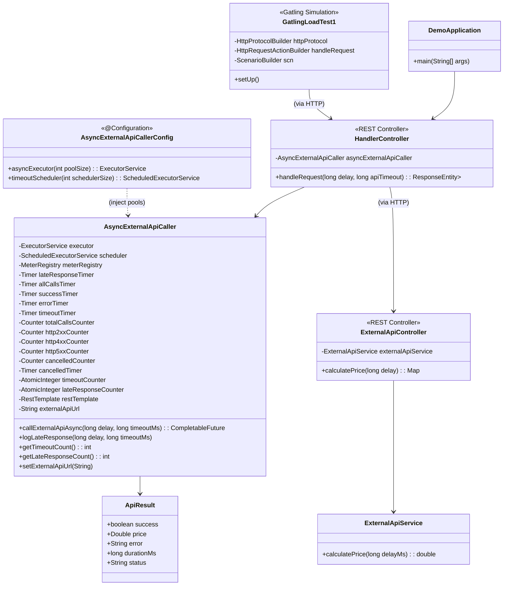
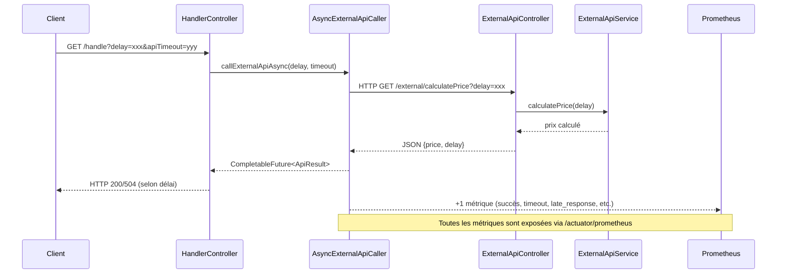
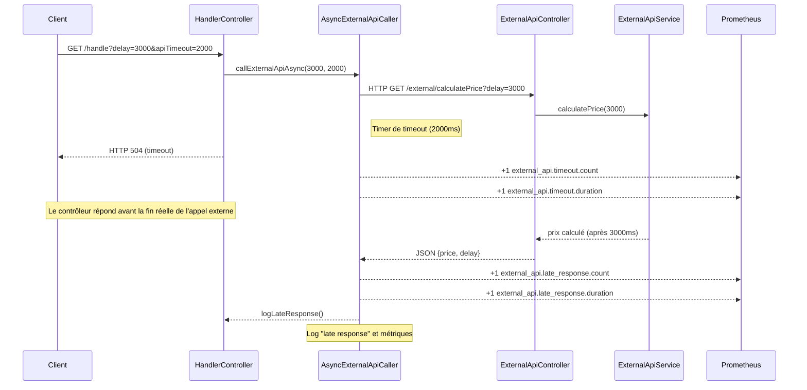

# Diagrammes d'architecture du POC

## 1. Diagramme de classes détaillé

### Description des classes principales

- **DemoApplication** : Point d'entrée de l'application Spring Boot.
- **HandlerController** : Contrôleur REST qui gère les requêtes `/handle` et utilise `AsyncExternalApiCaller` pour appeler l'API externe de façon asynchrone.
- **AsyncExternalApiCaller** : Service qui encapsule l'appel asynchrone à l'API externe, la gestion des timeouts, des pools de threads et l'instrumentation des métriques (Micrometer).
- **ApiResult** : Classe représentant le résultat de l'appel à l'API externe (succès, erreur, prix, durée, statut).
- **AsyncExternalApiCallerConfig** : Configuration Spring pour injecter les pools de threads utilisés par `AsyncExternalApiCaller`.
- **ExternalApiController** : Contrôleur REST simulant une API externe lente.
- **ExternalApiService** : Service de calcul simulé pour l'API externe.
- **GatlingLoadTest1** : Simulation Gatling qui génère la charge sur `/handle` et vérifie les réponses et les SLA.

---

## 2. Diagramme de séquence (flux d'une requête asynchrone)

### Explications du flux
- Le client appelle `/handle` avec un délai et un timeout.
- Le contrôleur délègue à `AsyncExternalApiCaller` qui lance l'appel asynchrone.
- L'appel HTTP est fait vers l'API externe simulée.
- Le service simule un délai et retourne un prix.
- Selon le délai, le contrôleur retourne un succès ou un timeout (504).
- Les métriques sont incrémentées et exposées pour Prometheus.

---

## 3. Notes complémentaires

- Les pools de threads sont injectés et mutualisés via Spring (voir `AsyncExternalApiCallerConfig`).
- L'observabilité est assurée par Micrometer, Prometheus, et l'extraction automatisée des métriques après chaque test de charge.
- Le test de charge Gatling simule des scénarios variés et vérifie les SLA sur `/handle`.
- Le découplage entre contrôleur, service asynchrone et API externe permet de tester facilement la résilience et la scalabilité.

---

## 4. Diagramme de séquence : scénario de timeout

### Explications du scénario timeout
- Le client demande un délai supérieur au timeout autorisé.
- Le contrôleur délègue à `AsyncExternalApiCaller` qui lance l'appel asynchrone et le timer de timeout.
- Le timeout est atteint avant la réponse de l'API externe : le contrôleur répond en 504 (Gateway Timeout).
- Les métriques de timeout sont incrémentées.
- Quand la réponse externe arrive finalement, une métrique "late response" est incrémentée et un log est généré.
- Ce scénario permet de monitorer la robustesse et la réactivité du système face aux lenteurs externes. 