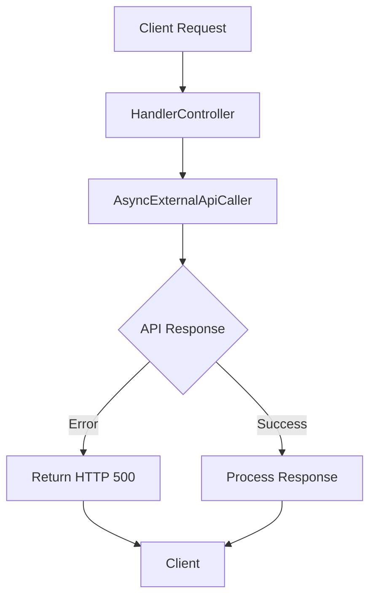
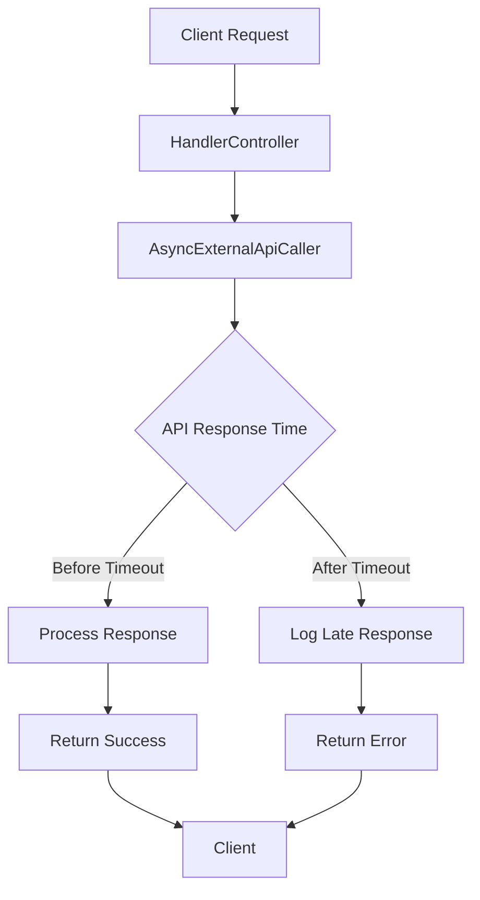

# Patterns asynchrones utilisés dans le projet

## 1. Pool de threads (ExecutorService)

- **Description** : Utilisation d'un `ExecutorService` pour gérer un pool de threads, permettant d'exécuter des tâches asynchrones sans bloquer le thread principal.
- **Pourquoi** : Le pool de threads permet de limiter le nombre de threads actifs, évitant ainsi une surcharge du système. Il est idéal pour les tâches I/O-bound (comme les appels réseau) où le thread principal ne doit pas être bloqué.

> **Voir [POOL_CONFIGURATION.md](POOL_CONFIGURATION.md) pour la configuration détaillée des pools de threads.**

## 2. CompletableFuture

- **Description** : Utilisation de `CompletableFuture` pour gérer les résultats des opérations asynchrones, permettant de chaîner des actions et de gérer les erreurs de manière élégante.
- **Pourquoi** : `CompletableFuture` offre une API moderne et flexible pour gérer l'asynchrone, facilitant la composition de plusieurs opérations asynchrones et la gestion des timeouts.

## 3. Gestion des timeouts

- **Description** : Implémentation d'un mécanisme de timeout pour les appels à l'API externe, retournant une erreur HTTP 504 si l'API ne répond pas dans les temps.
- **Pourquoi** : Cela permet de libérer rapidement les ressources et de maintenir la réactivité de l'application, évitant ainsi de bloquer le traitement principal.

> **Voir [TIMEOUT_EXPLAINED.md](TIMEOUT_EXPLAINED.md) et [USE_CASES_ASYNC_TIMEOUT.md](USE_CASES_ASYNC_TIMEOUT.md) pour les détails sur la gestion des timeouts et les cas d'usage.**

## 4. Logging des réponses tardives

- **Description** : Logging des réponses de l'API externe qui arrivent après le timeout, sans les transmettre au client.
- **Pourquoi** : Cela permet de garder une trace des réponses tardives pour le débogage et l'analyse, sans affecter le comportement de l'application.

## 5. Tests de charge avec Gatling

- **Description** : Utilisation de Gatling pour simuler des appels concurrents à l'API et vérifier le comportement sous charge.
- **Pourquoi** : Cela permet de valider la robustesse et la performance de l'application, en s'assurant que les timeouts et les erreurs sont gérés correctement.

> **Voir [GATLING.md](GATLING.md) pour les détails sur les tests de charge et les scénarios avancés.**

## 6. Callbacks

- **Description** : Utilisation de callbacks pour gérer les résultats des opérations asynchrones, permettant de réagir aux résultats de manière non-bloquante.
- **Pourquoi** : Les callbacks permettent de traiter les résultats des opérations asynchrones de manière élégante, en évitant de bloquer le thread principal et en facilitant la composition de plusieurs opérations.

### Exemple d'utilisation

```java
CompletableFuture<ApiResult> future = asyncExternalApiCaller.callExternalApiAsync(delay, timeout);

future.thenAccept(result -> {
    // Callback en cas de succès
    if (result.isSuccess()) {
        // Traitement du résultat
        System.out.println("API call successful: " + result.getPrice());
    } else {
        // Gestion de l'erreur
        System.out.println("API call failed: " + result.getError());
    }
});
```

## 7. Gestion des Erreurs de l'API

- **Description** : Si l'API externe répond par une erreur, le code gère cette situation en retournant une réponse HTTP 500 (Internal Server Error) au client.
- **Pourquoi** : Cela permet de signaler clairement au client qu'une erreur s'est produite lors de l'appel à l'API, tout en maintenant la robustesse de l'application.

### Exemple de flux



## Flow Chart



## Conclusion

L'utilisation de ces patterns asynchrones, y compris les callbacks, permet de maintenir la performance et la réactivité de l'application, tout en gérant efficacement les appels à l'API externe et les timeouts. Ces choix sont adaptés aux contraintes de Java 11 et aux besoins de robustesse du projet.

**Dernière mise à jour : juin 2025** 