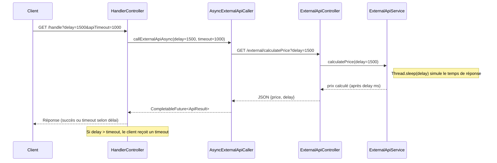

# Paramètres `delay` et `timeout` dans l'API `/handle`

## Schéma du flux

## Explications

- **delay** : temps d'attente simulé (en ms) par l'API externe.  
  Plus il est grand, plus la réponse de l'API externe est lente.
- **timeout** : durée maximale d'attente (en ms) côté `/handle` pour la réponse de l'API externe.  
  Si la réponse de l'API externe (donc le delay) dépasse ce timeout, le client reçoit une erreur de timeout.

**Cas d'usage :**
- `delay < timeout` → succès, le client reçoit un prix.
- `delay > timeout` → timeout, le client reçoit une erreur.

> **Voir [PATTERNS_ASYNC.md](PATTERNS_ASYNC.md) pour la gestion technique des timeouts et [USE_CASES_ASYNC_TIMEOUT.md](USE_CASES_ASYNC_TIMEOUT.md) pour les cas d'usage détaillés.**

**Dernière mise à jour : juin 2025** 